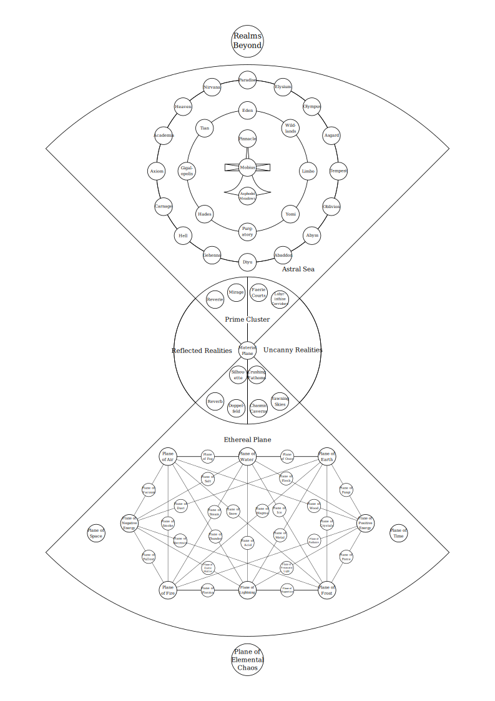

In the worlds of Dungeons and Dragons, Pathfinder, and other related games of fantasy roleplay, the planes are otherworldly dimensions filled with adventure, magic, danger, and world shaking conflicts.

The planes of this reality and the way they’re organised is called the hourglass cosmogony. The cosmogony takes the approximate form of an hourglass or, geometrically, a bicone. It is composed of two cones that intersect at their points (or apexes, geometrically) where the [Material Plane](prime/material.md) and [Prime Cluster](prime/index.md) are found.

The first cone is composed of the planes concerning the material world. This includes the ethereal, elemental, and dimensional planes. Beyond the [Inner Planes](inner/index.md) sits the [Primal Chaos](beyond/primal-chaos.md)

The second cone is composed of the planes concerning the metaphysical spirit and includes the astral and outer planes.

